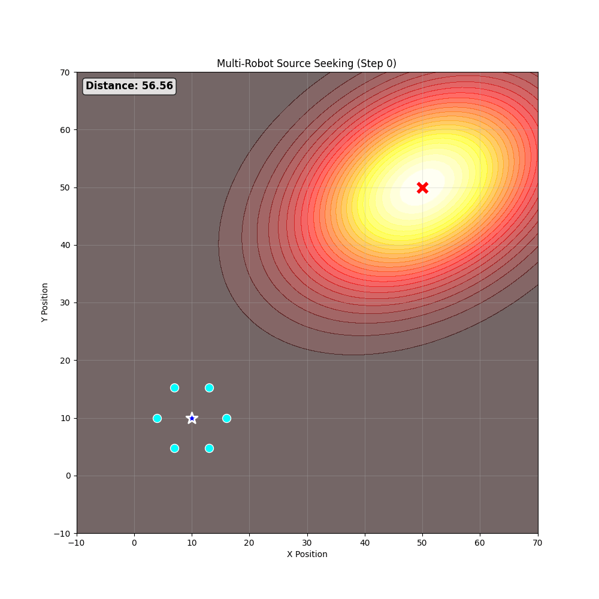
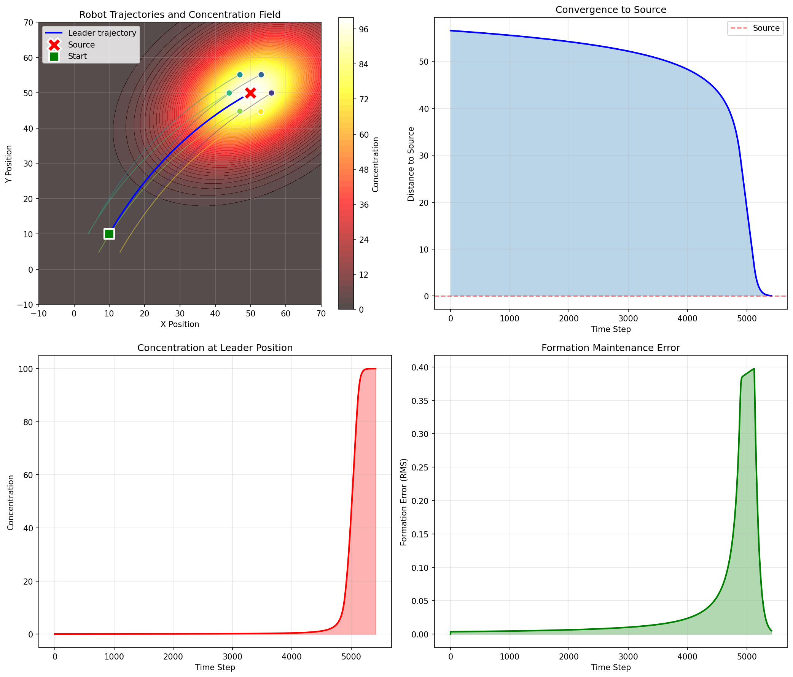
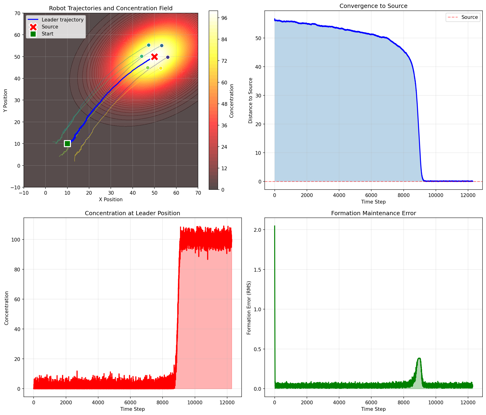

# Multi-Robot Source Seeking with Formation Control

## Overview

This project simulates a **source seeking problem** where a team of mobile robots equipped with concentration sensors works cooperatively to locate an unknown source. The robots maintain a geometric formation and use distributed measurements to estimate the concentration gradient, progressively converging toward the source.

The implementation uses a simplified but modular architecture that can be extended to more complex models.

---

## Project Structure

```
multi-robot-source-seeking/
├── concentration_field.py   # 2D Gaussian Plume concentration model
├── robot.py                 # Robot and RobotTeam classes with sensors
├── formation_control.py     # Artificial Potential Fields formation control
├── gradient_estimation.py   # Least squares gradient estimation
├── control_laws.py          # Control laws for leader and followers
├── main.py                  # Main simulation script
├── requirements.txt         # Python dependencies
└── README.md                # This file
├── results/
│   ├── simulation_results.png
│   └── simulation.gif
```

---

## Installation

### Requirements

- Python 3.8+
- NumPy
- Matplotlib

### Setup

```bash
# Clone or navigate to the project directory
cd multi-robot-source-seeking

# Install dependencies
pip install -r requirements.txt
```

---

## Usage

### Running the Simulation

```bash
python main.py
```

This will:
1. Initialize a team of 7 robots (1 leader + 6 in hexagonal formation)
2. Create a 2D Gaussian concentration field 
3. Run the source seeking algorithm for `num_steps`
4. Display convergence results and save visualization to `simulation_results.png`


---

## Problem Description

### 1. Concentration Model (Gaussian Plume Model)

The concentration field is modeled as a **2D Gaussian function** defined over a
two-dimensional environment.

- **Space**: 2D environment (x ∈ R^2)
- **Source**: located at an unknown position x0
- **Concentration function**:

$$
c(x) = A \exp\left(-\frac{1}{2}(x - x_0)^T P^{-1}(x - x_0)\right)
$$

  where:
  - x0 is the source position
  - A is the source intensity (maximum concentration)
  - P is the covariance matrix determining the spatial spread, shape,
    and orientation of the concentration field

The concentration is maximum at the source and decreases smoothly with distance
according to the Gaussian distribution.

### 2. Robot Team and Sensors

The system consists of **N mobile robots** with the following characteristics:

- Each robot knows its own position
- Each robot has a concentration sensor measuring $c(x)$ at its location
- Robots do not know the source position $x_0$
- Robots can communicate to share concentration measurements

### 3. Formation Control (Artificial Potential Fields)

To estimate the concentration gradient direction, robots maintain a **fixed symmetric geometric formation** using **Artificial Potential Fields (APF)**:

**Formation Structure**:
- One **central robot (leader)**
- $N-1$ robots arranged on a **regular polygon** around the leader (e.g., hexagon)
- **Communication graph**:
  - Leader connected to all outer robots
  - Each outer robot connected to adjacent neighbors

Each robot maintains:
- Fixed distance from the leader
- Correct distance from adjacent robots

Formation control minimizes a formation potential $J_{\text{for}}(p)$ depending on all robot positions.

### 4. Gradient Estimation 

At each time step:
1. All robots measure local concentration
2. Measurements are shared across the team
3. A **gradient estimate** $\hat{g}_t$ is computed from distributed measurements

This estimate indicates the direction of maximum concentration increase.

#### Mathematical Formulation

The gradient is estimated using a **leader-centered least squares** approach. Given the leader position $p_0$ and follower positions $p_i$ ($i = 1, \ldots, N-1$), the concentration field is locally approximated as:

$$c(p_i) - c(p_0) \approx \nabla c(p_0)^\top (p_i - p_0)$$

This leads to the linear system:

$$M \hat{g} = v$$

where:
- $M \in \mathbb{R}^{(N-1) \times 2}$ is the **position difference matrix**:
- $v \in \mathbb{R}^{N-1}$ is the **concentration difference vector**
- $\hat{g} \in \mathbb{R}^2$ is the **estimated gradient**

The least squares solution is:

$$\hat{g} = (M^\top M)^{-1} M^\top v$$

This formulation benefits from well-distributed robot configurations around the leader


#### Optional Extension: Weighted Least Squares

In addition to the standard formulation presented above, an optional **weighted least squares (WLS)** variant is also implemented.

In this case, each follower measurement is assigned a weight reflecting its relative importance or reliability. The weighted formulation becomes:

$$\hat{g} = (M^\top W M)^{-1} M^\top W v$$

where:
- $W \in \mathbb{R}^{(N-1)\times(N-1)}$ is a diagonal matrix of positive weights
- higher weights emphasize measurements considered more informative (e.g., higher concentration values)

This variant can improve robustness in scenarios where measurement quality is non-uniform.  
However, the standard least squares formulation is used as the default. The weighted variant was implemented for experimentation purposes only.


### 5. Control Laws

**Non-leader robots**:
$$p_i(t+1) = p_i(t) - T_s K_{\text{for}} \frac{\partial J_{\text{for}}}{\partial p_i}$$

where:
- $T_s$: sampling time
- $K_{\text{for}}$: formation control gain
- Anti-gradient term maintains formation

**Leader robot**:
$$p_1(t+1) = p_1(t) - T_s K_{\text{for}} \frac{\partial J_{\text{for}}}{\partial p_1} + T_s K_{\text{grad}} \hat{g}_t$$

The additional term:
- Drives the leader toward maximum concentration increase
- Guides the formation toward the source

### 6. System Behavior

1. Formation is maintained through APF
2. Distributed measurements enable gradient estimation
3. Leader follows the estimated gradient
4. Other robots follow the leader while maintaining formation
5. The entire group progressively converges to the source

---

## Implementation Details

### Modules

| Module | Description |
|--------|-------------|
| `concentration_field.py` | Implements 2D Gaussian Plume Model with configurable elliptical shape and rotation |
| `robot.py` | `Robot` class with position tracking and concentration sensing; `RobotTeam` manages formation and adjacency graph |
| `formation_control.py` | APF-based formation controller minimizing inter-robot distance errors |
| `gradient_estimation.py` | Leader-centered least squares gradient estimator (baseline) with optional concentration-weighted variant |
| `control_laws.py` | `SourceSeekingController` and `AdaptiveController` implementing the control laws |

### Optional Extensions

- **Velocity Clipping**: Prevents numerical instability by limiting maximum robot velocity
- **Weighted Gradient Estimation**: Optional weighting scheme giving more importance to higher concentration readings
- **Adaptive Controller**: Dynamically adjusts gradient gain based on concentration levels
- **Early Stopping Criteria**: Optional convergence detection based on concentration and gradient stability over a time window.
- **Animation & GIF export**: visualization of trajectories with adjustable playback speed

These additional elements are optional extensions introduced for numerical stability, convergence and experimentation, and do not alter the core structure of the formation control and gradient-following algorithm.

---

## Simulation Results

The following results illustrate the behavior of the multi-robot source seeking system in a representative simulation scenario.

### Simulation Parameters

| Parameter | Value |
|-----------|-------|
| Source position | (50.0, 50.0) |
| Initial position | (10.0, 10.0) |
| Number of robots | 7 (1 leader + 6 followers) |
| Formation radius | 6.0 |
| Controller | Adaptive Controller |
| Early stopping | Enabled (high concentration and low gradient stability) |

### Final Results Summary

| Metric | Value |
|--------|-------|
| **Converged** | YES |
| **Total steps** | 5,415 / 15,000 |
| **Initial distance to source** | 56.57 |
| **Final distance to source** | 0.07 |
| **Improvement** | 99.9% |
| **Final concentration** | 100.00 |
| **Final formation error** | 0.0053 |
| **Max formation error** | 0.3975 |

These results indicate successful localization of the source while preserving the desired formation with only temporary degradation during fast convergence.

### Simulation Animation

If enabled, the simulation can generate an animation illustrating the real-time behavior of the robot team during source seeking.



The animation shows:
- the **leader robot** moving toward increasing concentration regions,
- the **follower robots** maintaining a hexagonal formation,
- the **concentration field** represented as a background heatmap,
- the **trajectories** traced during motion.

### Performance Graphs



#### Graph Analysis

The figure summarizes the system behavior over time:

1. **Distance to Source**  
   The distance decreases monotonically, with slow progress in low-gradient regions and rapid convergence near the source.

2. **Concentration at Formation Center**  
   The measured concentration increases steadily as the robots approach the source, reaching the maximum value at convergence.

3. **Formation Error**  
   The formation is well maintained throughout the simulation. A temporary increase occurs during the final convergence phase, when the leader accelerates toward the source, followed by rapid recovery.


### Final Observations

- **Two-phase behavior**: an initial slow exploration phase followed by rapid convergence near the source.
- **Formation–gradient trade-off**: aggressive gradient following temporarily affects formation accuracy, which is quickly restored.
- **Successful convergence**: the robot team reliably reaches the source.


---

## Realistic Simulation with Disturbances

To evaluate the robustness of the source seeking algorithm under more realistic conditions, the simulation has been extended to include:

1. **Initial Formation Disturbance**: Gaussian noise applied to the initial positions of all robots
2. **Measurement Noise**: Gaussian noise added to concentration sensor readings


### Simulation Modes

The `main()` function supports two modes:

- **`'ideal'`** : No disturbances, strict convergence criteria
- **`'realistic'`**: With formation and measurement noise, relaxed criteria

### Relaxed Convergence Criteria

Due to the stochastic nature of measurements in the realistic scenario, the early stopping criteria had to be relaxed:

| Parameter | Ideal | Realistic |
|-----------|-------|-----------|
| `concentration_threshold` | 99.0 | **95.0** |
| `gradient_norm_threshold` | 0.1 | **0.5** |
| `stability_window` | 100 | **10** |

**Rationale**:
- **Lower concentration threshold**: Measurement noise causes the observed concentration to fluctuate around the true value, making it harder to consistently exceed 99%
- **Higher gradient threshold**: Noisy measurements produce noisier gradient estimates, requiring a more tolerant threshold
- **Smaller stability window**: Sustained stability is harder to achieve with noise; a shorter window allows convergence detection while still filtering transient spikes

### Realistic Simulation Results

#### Configuration

| Parameter | Value |
|-----------|-------|
| Source position | (50.0, 50.0) |
| Initial position | (10.0, 10.0) |
| Number of robots | 7 |
| Formation radius | 6.0 |
| **Formation noise (σ)** | **1.5** |
| **Measurement noise (σ)** | **3.0** |
| Controller | Adaptive Controller |

#### Results Summary

| Metric | Value |
|--------|-------|
| **Converged** | YES |
| **Total steps** | 12,285 / 15,000 |
| **Initial distance to source** | 56.57 |
| **Final distance to source** | 0.07 |
| **Improvement** | 99.9% |
| **Final concentration** | 99.00 |
| **Final formation error** | 0.0313 |
| **Average formation error** | 0.0488 |
| **Max formation error** | 2.0472 |

#### Key Observations

1. **Initial Formation Error Spike**: At step 0, the formation error is **2.05** (compared to 0.0 in ideal case) due to the initial position perturbation. The formation controller quickly recovers this within ~50 steps.

2. **Noisy Concentration Readings**: The measured concentration fluctuates significantly (sometimes showing 0.0 when the true value is ~0.05), demonstrating the effect of the Gaussian noise (σ=3.0).

3. **Slower Convergence**: The algorithm requires **12,285 steps** to converge (vs. 5,415 in ideal case) due to:
   - Noisier gradient estimates causing less consistent direction
   - Occasional "wrong" steps due to measurement errors

4. **Successful Source Localization**: Despite the disturbances, the algorithm still achieves **99.9% improvement** with a final distance of only **0.07** from the source.

### Realistic Simulation Animation


The animation shows the more erratic trajectory caused by noisy gradient estimates, while still successfully converging to the source.

### Realistic Performance Graphs



#### Graph Analysis (Realistic Case)

1. **Distance to Source**: Shows a slower, more irregular descent compared to the ideal case, with occasional small increases due to incorrect gradient estimates.

2. **Concentration at Leader**: Exhibits significant noise, with readings fluctuating widely. Values occasionally exceed 100 (due to positive noise) or drop to 0 (when noise overwhelms the true signal at low concentrations).

3. **Formation Error**: The initial spike at step 0 (≈2.05) shows the effect of formation noise. After recovery, the error remains slightly higher than the ideal case (avg 0.0488 vs 0.041) but within acceptable bounds.

### Comparison: Ideal vs Realistic

| Metric | Ideal | Realistic | Difference |
|--------|-------|-----------|------------|
| Convergence steps | 5,415 | 12,285 | +127% |
| Final distance | 0.07 | 0.07 | Same |
| Avg formation error | 0.041 | 0.049 | +20% |
| Max formation error | 0.40 | 2.05 | +413% |

**Conclusion**: The algorithm demonstrates robustness to realistic disturbances, successfully localizing the source despite noisy sensors and imperfect initial formation. The main trade-off is increased convergence time.
